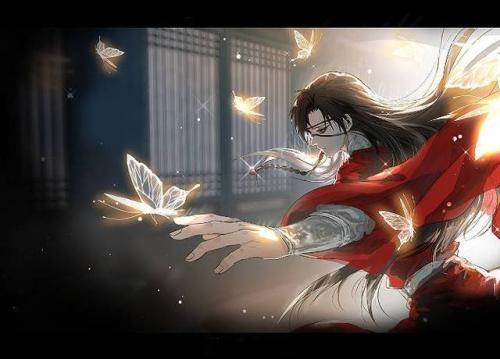

# 标题
## 人生若只如初见
### 人生若只如初见
#### 人生若只为初见
###### 人生若只为初见  


# 段落
### 中间没有空行的连续不断的几行文字被视为一个段落。
浔阳江头夜送客，
枫叶荻花秋瑟瑟。
主人下马客在船，
举酒欲饮无管弦。  
<br/>


# 行内格式
浔阳江头**夜送客**，
枫叶荻花*秋瑟瑟*。
主人下马**客在船**，
举酒欲饮*无管弦*。
<br/>

# 引用块
>浔阳江头夜送客，
>>枫叶荻花秋瑟瑟。
>>>主人下马客在船，
>>>>举酒欲饮无管弦。
>>>>># 醉不成欢惨将别
>>>>>>别时茫茫江浸月
<br/>


# 超链接
行内式网络图片 [图片](https://image.baidu.com/search/detail?ct=503316480&z=0&ipn=d&word=%E6%98%9F%E7%A9%BA%E5%9B%BE%E7%89%87&hs=2&pn=4&spn=0&di=139810&pi=0&rn=1&tn=baiduimagedetail&is=0%2C0&ie=utf-8&oe=utf-8&cl=2&lm=-1&cs=2147496214%2C1127277496&os=976346410%2C457490794&simid=4248091703%2C515541735&adpicid=0&lpn=0&ln=30&fr=ala&fm=&sme=&cg=&bdtype=0&oriquery=%E6%98%9F%E7%A9%BA%E5%9B%BE%E7%89%87&objurl=https%3A%2F%2Fgimg2.baidu.com%2Fimage_search%2Fsrc%3Dhttp%3A%2F%2Fcdn.duitang.com%2Fuploads%2Fitem%2F201511%2F13%2F20151113085245_jHAd2.jpeg%26refer%3Dhttp%3A%2F%2Fcdn.duitang.com%26app%3D2002%26size%3Df9999%2C10000%26q%3Da80%26n%3D0%26g%3D0n%26fmt%3Djpeg%3Fsec%3D1621433852%26t%3D128f921ca7448475e2be700719690ea1&fromurl=ippr_z2C%24qAzdH3FAzdH3Fooo_z%26e3B17tpwg2_z%26e3Bv54AzdH3Frj5rsjAzdH3F4ks52AzdH3F9bab0cnclAzdH3F1jpwtsAzdH3F&gsm=5&islist=&querylist=) 链接  

引用式网络图片 [图片][1] 链接

[1]:https://gimg2.baidu.com/image_search/src=http%3A%2F%2Fnimg.ws.126.net%2F%3Furl%3Dhttp%253A%252F%252Fdingyue.ws.126.net%252F2021%252F0419%252F5743d2bdp00qrsqya00nbc000tx00fxc.png%26thumbnail%3D650x2147483647%26quality%3D80%26type%3Djpg&refer=http%3A%2F%2Fnimg.ws.126.net&app=2002&size=f9999,10000&q=a80&n=0&g=0n&fmt=jpeg?sec=1621434079&t=c4ddf9ed7a9956f0d4c64767d1bd62b1

# 网页图片


# 本地图片


# 列表
- 浔阳江头夜送客
- 枫叶荻花秋瑟瑟
- 主人下马客在船
- 举酒欲饮无管弦
  
1. 醉不成欢惨将别
2. 别时茫茫江浸月
3. 忽闻岸上琵琶声
4. 主人忘归客不发

# 代码块
``` 
#include <iostream>
using namespace std;
int main()
{
    cout<<"Hello World"<<endl;
    return 0;
}
```

# 水平分割线
浔阳江头夜送客
****
枫叶荻花秋瑟瑟
- - - 
主人下马客在船
- - -
举酒欲饮无管弦
*****

# 表格  

| 编号 |姓名(左)| 性别(中)|年龄(右)|
|----- |:-----|-----:|:------:|
|1|琪琪|女|20|
|2|黑黑|男|22|

# 任务列表
- [x] 数据结构
- [ ] 计算机组成原理
- [ ] 操作系统
- [ ] 计算机网络

# 删除线，粗体字，斜体字
~~我不爱学习~~
&emsp;&emsp;  
不，你爱！  

浔阳江头**夜送客**，
枫叶荻花*秋瑟瑟*。
主人下马**客在船**，
举酒欲饮*无管弦*。

# 自动链接
http://baidu.com
  
<123456@qq.com>

# 文件跳转
[另一个文件](work.md)

# 列表
>有序列表
1. hello 
2. hi
3. see you
>无序列表
* 浔阳江头夜送客
* 枫叶荻花秋瑟瑟
* 主人下马客在船
* 举酒欲饮无管弦  


#CPE
#CPE
